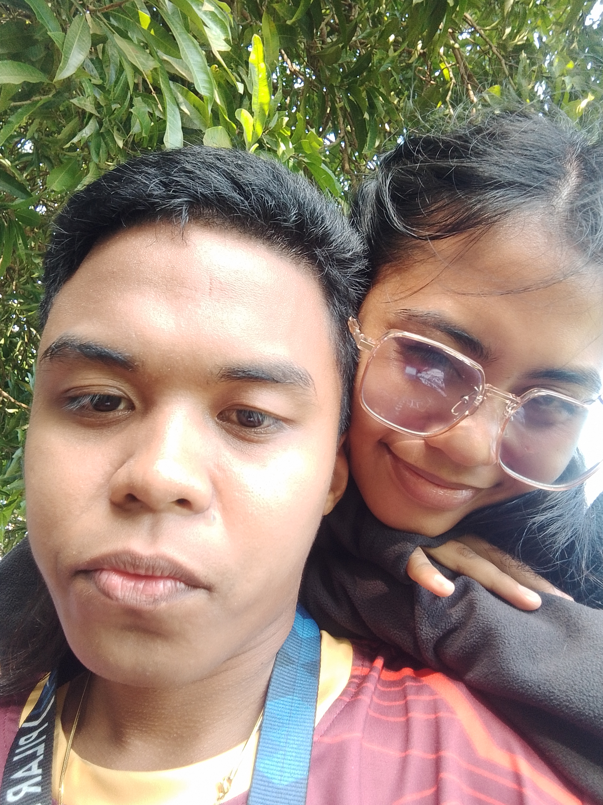

# 💕 Anniversary Gift Website

A beautiful, romantic, and interactive anniversary gift website built with HTML, Tailwind CSS, and vanilla JavaScript.

## ✨ Features

### 🔐 1. Private Login Screen
- Elegant design with animated gradients and floating particles
- Password-protected access (default passwords: "Adi", "2004", "Iloveyouadi")
- Gentle error messages with helpful hints
- Smooth transitions and glassmorphism effects

### 🧩 2. Interactive Puzzle Game
- Sliding tile puzzle with your custom image
- Tap/click two tiles to swap them
- Real-time progress tracking
- Beautiful completion animation
- Mobile and desktop friendly

### 💌 3. Love Letter
- Heartfelt anniversary message
- Elegant typography with Dancing Script and Playfair Display fonts
- Animated text reveal effects
- Decorative borders and gradients
- Personal and emotional tone

### 🖼️ 4. Memory Gallery
- 6 beautifully designed memory cards
- Hover effects and smooth transitions
- Modal popups with detailed captions
- Responsive masonry-style layout
- Each memory with custom emoji and gradient

### 💖 5. Final Surprise
- Grand finale with animated hearts
- Floating heart particles
- Music toggle functionality (ready for your song)
- Beautiful quote and anniversary message
- Pulsing animations and effects

## 🎨 Design Highlights

- **Color Palette**: Romantic pink, rose, and red gradients
- **Typography**: 
  - Dancing Script for romantic headings
  - Playfair Display for elegant titles
  - Poppins for clean body text
- **Effects**:
  - Glassmorphism (frosted glass effect)
  - Blob animations
  - Floating particles
  - Smooth transitions
  - Hover interactions
- **Responsive**: Mobile-first design, works on all devices
- 
# 🖼️ How to Add Your Own Puzzle Image - Quick Guide

## Method 1: Simple File Naming (EASIEST)

1. **Choose your photo** - Pick a nice, clear photo of you and your girlfriend
2. **Rename it to** `puzzle-image.jpg`
3. **Place it in the same folder** as `index.html`
4. **Open the website** - The puzzle will automatically use your image!

### File Structure Should Look Like:
```
anniversary-website/
├── index.html
├── styles.css
├── script.js
├── puzzle-image.jpg  ← YOUR IMAGE HERE
└── README.md
```

---

## Method 2: Different File Name

If you want to keep your original filename:

1. Open `index.html` in a text editor
2. Find this line (near the bottom):
```html

```
3. Replace `puzzle-image.jpg` with your filename:
```html

```
4. Save and refresh the website!

---

## Method 3: Using an Online Image

1. Upload your image to a free image hosting service (imgur.com, etc.)
2. Get the direct image URL
3. In `index.html`, update the src:
```html

```

---

## 📸 Best Image Recommendations

### ✅ GOOD Images:
- Clear, high-quality photos
- Good lighting and contrast
- Recognizable faces/subjects
- Square or nearly square (1:1 ratio)
- Minimum 600x600 pixels
- JPG or PNG format

### ❌ AVOID:
- Blurry or dark photos
- Very small images (will be pixelated)
- Images with too much detail (hard to solve)
- Photos with white/plain backgrounds (boring puzzle)

---

## 🎨 Image Format Support

Supported formats:
- ✅ JPG / JPEG
- ✅ PNG
- ✅ WebP
- ✅ GIF (first frame)

---

## 🔧 Troubleshooting

### Image Not Showing?
1. **Check the filename** - Make sure it's exactly `puzzle-image.jpg` (case-sensitive on some systems)
2. **Check the location** - Image must be in the same folder as index.html
3. **Check file format** - Use JPG, PNG, or WebP
4. **Try renaming** - Remove any spaces or special characters from filename

### Puzzle Shows Heart Instead?
- This means your image wasn't found
- The website defaults to a heart placeholder
- Double-check steps above

### Image Looks Stretched?
- The code automatically fits your image into a square
- For best results, use a square photo (1:1 ratio)
- Or crop your photo to square before uploading

---

## 💡 Pro Tips

### Make It Special:
1. **Choose a meaningful photo** - First date, special moment, favorite memory
2. **Edit the photo first** - Add text overlay like "Us ❤️" or a date
3. **Perfect the crop** - Zoom in on faces for emotional impact
4. **Test the difficulty** - Too detailed = too hard, too simple = too easy

### Advanced Customization:
Want to change puzzle difficulty?

In `script.js`, find:
```javascript
const CONFIG = {
    validPasswords: [...],
    floatingHeartInterval: 800,
    floatingHeartDuration: 8000,
    particleCount: 20,
    puzzleSize: 3  ← Change this number!
};
```

- `puzzleSize: 3` = 3x3 grid (9 pieces) - EASY
- `puzzleSize: 4` = 4x4 grid (16 pieces) - MEDIUM
- `puzzleSize: 5` = 5x5 grid (25 pieces) - HARD

---

## 📝 Quick Checklist

Before launching:
- [ ] Image saved as `puzzle-image.jpg`
- [ ] Image in same folder as `index.html`
- [ ] Image is clear and good quality
- [ ] Image is at least 600x600px
- [ ] Tested by opening `index.html` in browser
- [ ] Puzzle loads and looks good
- [ ] Successfully solved puzzle once

---

## 🎁 Example Workflow

1. **Select photo from your phone/computer**
2. **Open in photo editor** (even built-in tools work)
3. **Crop to square** (1:1 ratio)
4. **Resize if needed** (at least 600x600px)
5. **Save as** `puzzle-image.jpg`
6. **Move to website folder**
7. **Open index.html**
8. **Test the puzzle!**

---

## 🆘 Still Need Help?

If the image still doesn't work:

1. Open browser console (F12 or right-click → Inspect → Console)
2. Look for error messages
3. Common issues:
   - "Failed to load resource" = Wrong filename or location
   - "CORS error" = Use a local file, not a web URL
   - "Invalid image" = File is corrupted or wrong format

---

**Remember**: The website automatically handles:
- ✅ Resizing your image to fit
- ✅ Centering the image
- ✅ Creating the puzzle pieces
- ✅ Making it playable

You just need to provide a good photo! 💕

---

Happy puzzling! 🧩❤️

## 🚀 Getting Started

1. **Download all files** to a folder on your computer
2. **Open `index.html`** in any modern web browser
3. **Enter password** (try "Adi", "2004", or "Iloveyouadi")
4. **Enjoy the experience!**

## 🎯 Customization Guide

### Change Passwords

Edit `script.js`, line 6:

```javascript
const CONFIG = {
    validPasswords: ['adi', 'Adi', '2004', 'iloveyouadi', 'Iloveyouadi'],
    // Add or change passwords here
};
```

### Replace Puzzle Image

1. **Option 1**: Use the placeholder (current setup)
   - The default heart image is automatically generated

2. **Option 2**: Use your own image
   - In `script.js`, find the `createPlaceholderImage()` function (around line 193)
   - Replace it with:

```javascript
function createPlaceholderImage() {
    // Simply return your image URL
    return 'path/to/your/image.jpg';
}
```

### Customize Love Letter

Edit `index.html`, find the "Love Letter" section (around line 154):

```html
<p class="fade-in" style="animation-delay: 0.3s;">
    Your personalized message here...
</p>
```

Change the text in each paragraph to make it more personal.

### Edit Gallery Memories

Edit `script.js`, find the `memories` array (around line 24):

```javascript
const memories = [
    {
        title: "Your Title",
        caption: "Your personal message here...",
        emoji: "📸",
        color: "from-pink-300 via-rose-300 to-pink-400"
    },
    // Add more memories...
];
```

### Add Real Photos to Gallery

In `index.html`, find each gallery card (starting around line 253) and replace:

```html
<div class="relative aspect-square bg-gradient-to-br from-pink-300 via-rose-300 to-pink-400 flex items-center justify-center overflow-hidden">
    <span class="text-8xl group-hover:scale-125 transition-transform duration-500">📸</span>
</div>
```

With:

```html
<div class="relative aspect-square overflow-hidden">
    
</div>
```

### Add Background Music

1. **Add your audio file** to the project folder
2. **In `index.html`**, add before closing `</body>` tag:

```html
<audio id="backgroundMusic" loop>
    <source src="your-song.mp3" type="audio/mpeg">
</audio>
```

3. **In `script.js`**, update the `toggleMusic()` function (around line 554):

```javascript
function toggleMusic() {
    const button = document.getElementById('musicButton');
    const audio = document.getElementById('backgroundMusic');
    
    if (!button || !audio) return;

    state.musicPlaying = !state.musicPlaying;

    if (state.musicPlaying) {
        audio.play();
        button.innerHTML = `
            <span class="text-2xl">⏸️</span>
            Pause Our Song
        `;
        button.classList.add('pulse-slow');
    } else {
        audio.pause();
        button.innerHTML = `
            <span class="text-2xl">🎵</span>
            Play Our Song
        `;
        button.classList.remove('pulse-slow');
    }
}
```

### Change Final Message

Edit `index.html`, find the "Final Surprise" section (around line 430):

```html
<p class="fade-in">
    Your personalized anniversary message here...
</p>
```

## 🎨 Color Customization

To change the color scheme, update these CSS variables in `styles.css`:

Current palette uses:
- Pink: `#ec4899`
- Rose: `#f43f5e`
- Red: `#fb7185`

Find and replace these hex codes throughout the files with your preferred colors.

## 🌐 Browser Support

- ✅ Chrome (recommended)
- ✅ Firefox
- ✅ Safari
- ✅ Edge
- ✅ Mobile browsers

## 📱 Mobile Optimization

The website is fully responsive and optimized for:
- Mobile phones (portrait and landscape)
- Tablets
- Desktop computers
- Large displays

## 💡 Tips for Best Experience

1. **Use headphones** for the music feature
2. **Full screen mode** for immersive experience
3. **Good internet** for smooth animations
4. **Modern browser** for best compatibility
5. **Privacy mode** to keep it secret until ready

## 🎁 Presenting the Gift

### Option 1: Local File
1. Save all files in a folder
2. Open `index.html` when ready
3. Let her explore at her own pace

### Option 2: Host Online
1. Upload to GitHub Pages, Netlify, or Vercel
2. Share the link
3. She can access from anywhere

### Option 3: USB Drive
1. Save everything on a USB drive
2. Include a note with instructions
3. Make it a physical gift too!

## 🔧 Troubleshooting

**Images not showing?**
- Check file paths are correct
- Ensure images are in the same folder or correct subfolder

**Animations not smooth?**
- Clear browser cache
- Try a different browser
- Check internet connection

**Password not working?**
- Check for typos
- Passwords are case-sensitive
- Verify in `script.js` CONFIG

**Music not playing?**
- Check audio file path
- Ensure browser allows autoplay
- Try clicking play button again

## 📝 License

This is a personal gift project. Feel free to use and customize for your own romantic purposes! ❤️

## 💖 Final Notes

This website was crafted with love and attention to detail. Every animation, every color, every word was chosen to create a memorable experience. 

Make it your own by:
- Adding personal photos
- Writing heartfelt messages
- Including inside jokes
- Adding your special song
- Customizing colors to her favorites

Remember: The most important part is the love and thought you put into it! 💕

---

**Made with ❤️ for someone special**

Happy Anniversary! 🎉